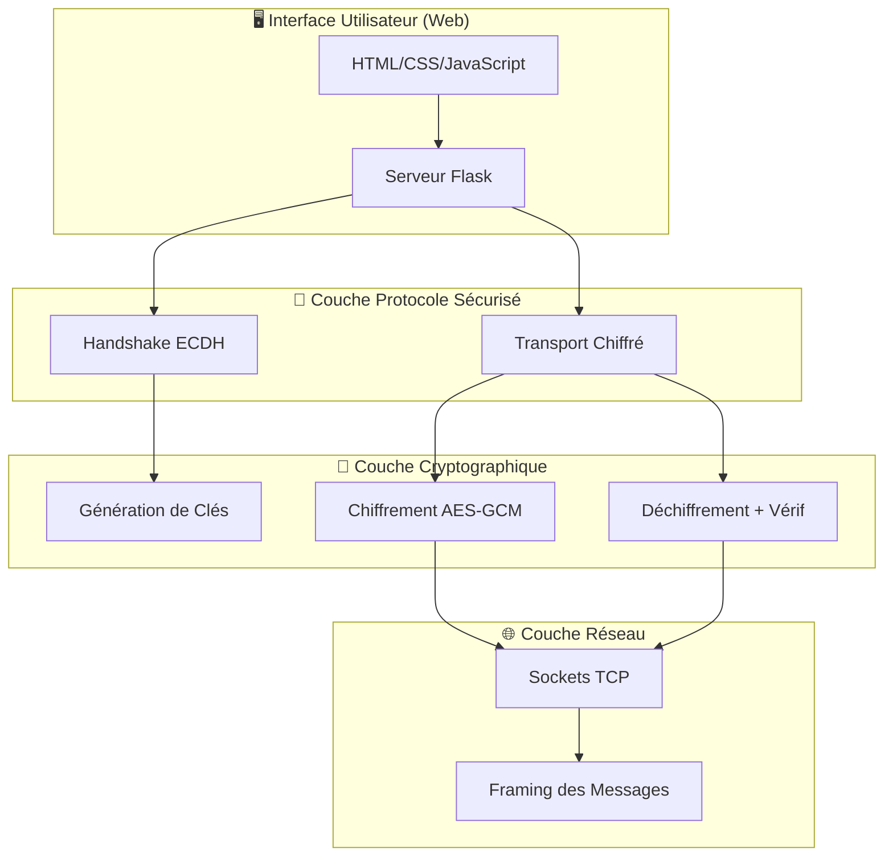
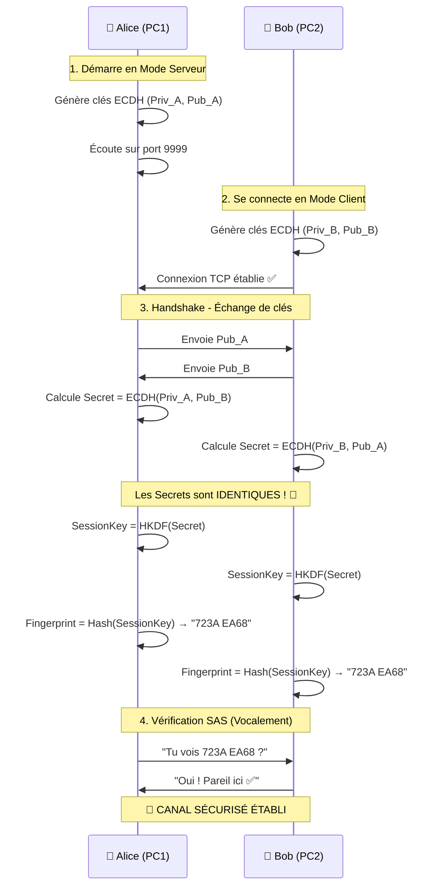
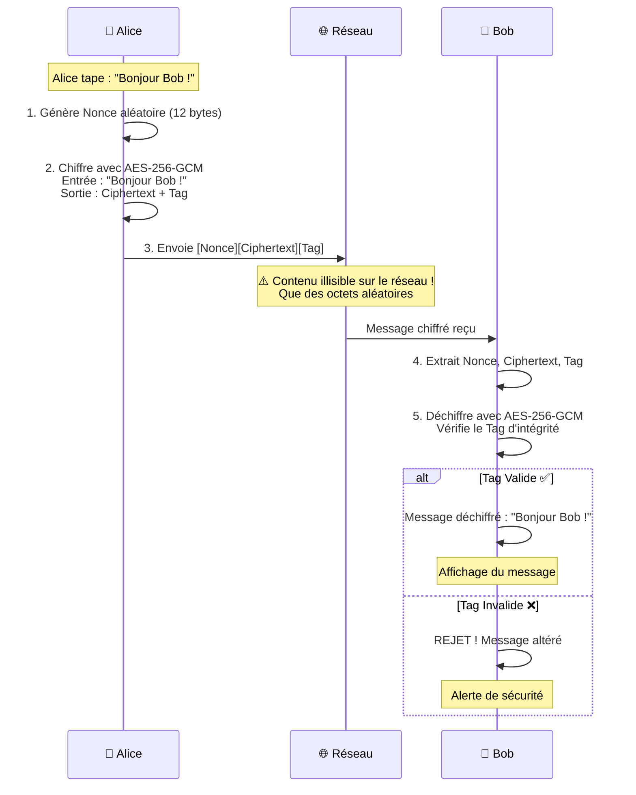

# 📚 Guide Explicatif - Secure LAN Chat

## 🎯 Introduction

Ce document explique de manière simple et visuelle **comment fonctionne l'application Secure LAN Chat**, pour faciliter la compréhension du système et de sa cryptographie.

---

## 🏗️ Vue d'Ensemble de l'Architecture

L'application est construite en **couches indépendantes** :



### Avantages de cette Architecture

| Couche | Responsabilité | Indépendance |
|--------|---------------|--------------|
| **Interface** | Afficher les messages, recevoir les entrées utilisateur | Ne connaît PAS la cryptographie |
| **Protocole** | Orchestrer le handshake et le transport | Utilise crypto + réseau |
| **Crypto** | Chiffrer/Déchiffrer | Ne connaît PAS le réseau |
| **Réseau** | Envoyer/Recevoir des octets | Ne connaît PAS la crypto |

---

## 🔄 Flux de Communication Complet

### Phase 1️⃣ : Établissement de la Connexion



### Phase 2️⃣ : Échange de Messages Sécurisés



---

## 🔐 Cryptographie Expliquée Simplement

### 1. ECDH (Elliptic Curve Diffie-Hellman)

**Problème à résoudre :** Comment deux personnes peuvent-elles créer un secret commun sans jamais l'échanger ?

**Solution ECDH :**

```
Alice                           Bob
  |                              |
  | Génère Priv_A (secret)      | Génère Priv_B (secret)
  | Calcule Pub_A = f(Priv_A)   | Calcule Pub_B = f(Priv_B)
  |                              |
  |-------- Pub_A -------------->|
  |<------- Pub_B ---------------|
  |                              |
  | Secret = ECDH(Priv_A, Pub_B) | Secret = ECDH(Priv_B, Pub_A)
  |                              |
  
  Secret Alice === Secret Bob  ✅
  
  Espion qui voit Pub_A et Pub_B → NE PEUT PAS calculer le Secret ❌
```

**Analogie :** C'est comme mélanger deux couleurs de peinture. Vous échangez vos mélanges publics, mais personne ne peut "démélanger" pour retrouver vos couleurs secrètes.

### 2. HKDF (Key Derivation Function)

**Pourquoi ?** Le secret ECDH a une bonne entropie mais est "brut". On le transforme en une clé cryptographique propre.

```
Secret brut (48 bytes)
       ↓
    [HKDF-SHA256]
       ↓
SessionKey AES-256 (32 bytes) ← Parfaite pour AES
```

### 3. AES-256-GCM (Authenticated Encryption)

**Garanties :**
- ✅ **Confidentialité** : Le message est illisible sans la clé
- ✅ **Intégrité** : Toute modification est détectée
- ✅ **Authenticité** : Seul le possesseur de la clé peut créer le message

**Fonctionnement :**

```
Message clair : "Bonjour Bob !"
      ↓
  [AES-256-GCM]
   SessionKey
   Nonce (unique)
      ↓
┌──────────────────────────────┐
│ Nonce (12B)                  │
│ Ciphertext (13B)             │ → Totalement aléatoire
│ Tag d'authentification (16B) │
└──────────────────────────────┘
```

**Nonce :** Nombre utilisé **une seule fois** (Number used ONCE). Garantit que le même message chiffré deux fois donne des ciphertexts différents.

**Tag GCM :** Preuve mathématique que le message n'a pas été modifié. Si un seul bit change, le tag devient invalide.

---

## 🛡️ Protection Contre les Attaques

### 1. Protection Sniffing (Écoute Passive)

```
Attaquant avec Wireshark
         |
         | Capture le trafic
         ↓
    [f31d2075bea3aaf8...]  ← Que du bruit aléatoire
         ↓
    ❌ Impossible à déchiffrer sans la SessionKey
```

### 2. Protection Man-in-the-Middle (MITM)

```
Sans Protection SAS :
Alice --[Pub_A]--> Attaquant --[Pub_Evil]--> Bob
  ✅ Handshake          ❌ MITM            ✅ Handshake
  
Avec Protection SAS :
Alice voit : "723A EA68"
Bob voit   : "8F2C 1D9A"  ← DIFFÉRENT !
         ↓
   ⚠️ ALERTE MITM DÉTECTÉE
   → Déconnexion immédiate
```

**Le SAS Fingerprint est dérivé du secret partagé. Si un attaquant s'interpose, les secrets (et donc les fingerprints) seront différents.**

### 3. Protection Tampering (Modification)

```
Message chiffré : [Nonce][Ciphertext][Tag ABC123]
        ↓
Attaquant modifie 1 bit
        ↓
Message altéré : [Nonce][Ciphertext*][Tag ABC123]
        ↓
Déchiffrement côté Bob
        ↓
Tag recalculé ≠ Tag reçu
        ↓
❌ REJET ! "Échec de l'intégrité du message"
```

---

## 📊 Tableau Récapitulatif des Algorithmes

| Algorithme | Rôle | Sécurité | Pourquoi ce choix ? |
|------------|------|----------|---------------------|
| **ECDH (SECP384R1)** | Échange de clés | ~192 bits | Équivalent 7680 bits RSA, Forward Secrecy |
| **HKDF-SHA256** | Dérivation de clé | 256 bits | Standard NIST, extraction d'entropie |
| **AES-256-GCM** | Chiffrement authentifié | 256 bits | AEAD (Confidentialité + Intégrité), Rapide |
| **SHA-256** | Fingerprint SAS | 256 bits | Hash cryptographique, collision-proof |

---

## 🔢 Tailles des Données

### Clés et Secrets

```
Clé Privée ECDH  : 48 bytes (384 bits)
Clé Publique ECDH: 215 bytes (format PEM)
Secret Partagé   : 48 bytes
Session Key AES  : 32 bytes (256 bits)
```

### Messages Chiffrés

```
Message clair    : "Hello" = 5 bytes

Après chiffrement:
  Nonce          : 12 bytes
  Ciphertext     : 5 bytes  (même taille que le clair)
  Tag GCM        : 16 bytes
  ─────────────────────────
  TOTAL          : 33 bytes

Overhead : +28 bytes par message
```

---

## 🚀 Flux de Démarrage Complet

### PC 1 (Serveur)

```
1. Lancer : python app.py
   ↓
2. Navigateur : http://127.0.0.1:5000
   ↓
3. Générer clés ECDH (Priv_A, Pub_A)
   ↓
4. Bind sur 0.0.0.0:9999
   ↓
5. Listen() → Attente connexion entrante
   ↓
6. Accept() → Connexion de PC2 établie ✅
   ↓
7. Envoyer Pub_A
   ↓
8. Recevoir Pub_B
   ↓
9. Calculer Secret, SessionKey, Fingerprint
   ↓
10. Afficher "✅ CANAL SÉCURISÉ - 723A EA68"
```

### PC 2 (Client)

```
1. Lancer : python app.py
   ↓
2. Navigateur : http://127.0.0.1:5000
   ↓
3. Générer clés ECDH (Priv_B, Pub_B)
   ↓
4. Connect(192.168.1.148, 9999)
   ↓
5. Connexion établie ✅
   ↓
6. Envoyer Pub_B
   ↓
7. Recevoir Pub_A
   ↓
8. Calculer Secret, SessionKey, Fingerprint
   ↓
9. Afficher "✅ CANAL SÉCURISÉ - 723A EA68"
```

---

## 🎓 Questions Fréquentes (FAQ)

### Q1 : Pourquoi "Serveur" et "Client" si c'est pair-à-pair ?

**R :** Les termes serveur/client concernent uniquement la **connexion TCP initiale** :
- Le "serveur" **écoute** (attend)
- Le "client" **appelle** (se connecte)

**Après la connexion**, les deux sont **parfaitement égaux** :
- Les deux peuvent envoyer des messages
- Les deux peuvent recevoir des messages
- Aucune hiérarchie

### Q2 : Pourquoi le SAS Fingerprint change à chaque connexion ?

**R :** C'est **voulu** ! Chaque session génère de **nouvelles clés éphémères** :
- Session 1 : Clés A1/B1 → Secret S1 → Fingerprint "723A EA68"
- Session 2 : Clés A2/B2 → Secret S2 → Fingerprint "9F1C 4D2E"

**Avantage :** Forward Secrecy. Si une clé future est compromise, les sessions passées restent sécurisées.

### Q3 : Les messages sont-ils stockés quelque part ?

**R :** **Non**, uniquement en mémoire RAM (volatile) :
- Avantage : Aucune trace persistante (sécurité maximale)
- Inconvénient : Messages perdus si l'application ferme

C'est un choix de sécurité pour un chat éphémère.

### Q4 : Peut-on utiliser cette app sur Internet ?

**R :** Pas directement. L'application est conçue pour un **réseau local** uniquement.

Pour Internet, il faudrait ajouter :
- NAT traversal (STUN/TURN)
- Certificats TLS pour l'interface web
- Gestion des IP dynamiques

---

## 📖 Pour Aller Plus Loin

### Améliorer la Sécurité

1. **Compteur de séquence** : Rejeter les messages dans le désordre ou rejoués
2. **Rotation de clés** : Re-handshake périodique (toutes les N minutes)
3. **PAKE** : Authentification par mot de passe (SPAKE2)

### Améliorer les Fonctionnalités

1. **Persistance** : Base de données chiffrée pour l'historique
2. **Multi-utilisateurs** : Serveur central avec E2E
3. **Transfert de fichiers** : Chiffrement AES-GCM par blocs

---

**🔐 Vous maîtrisez maintenant le fonctionnement complet de Secure LAN Chat ! 🎓**
